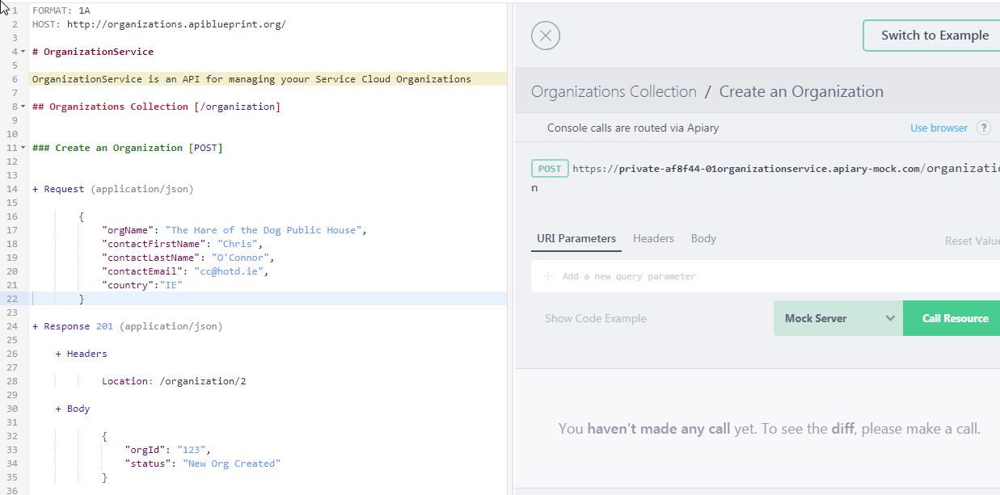
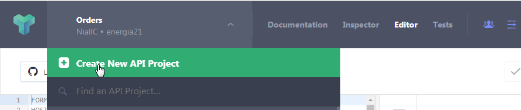
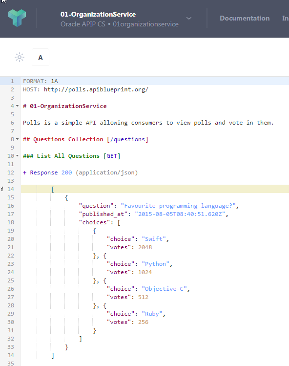
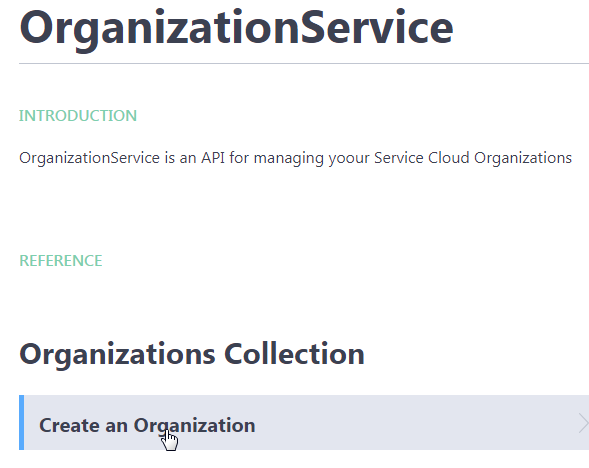
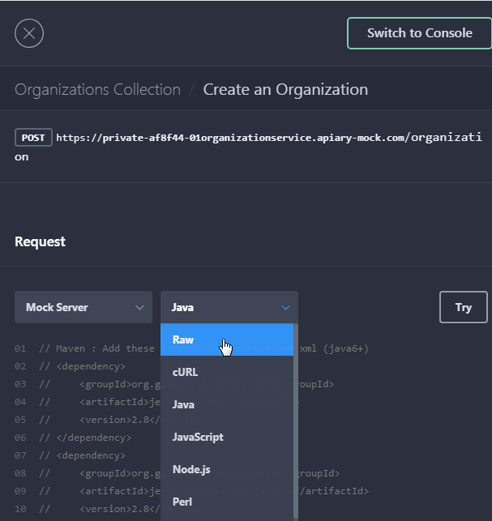
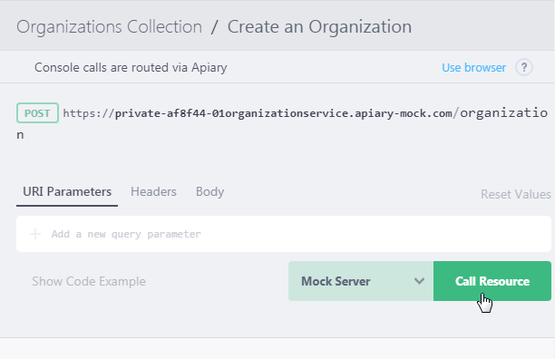
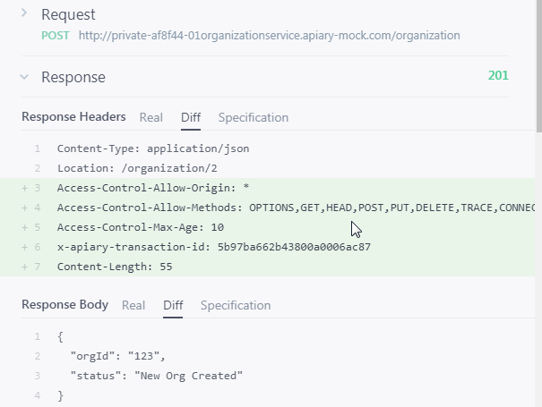

# API First and API Platform managed microservices


### Apiary - Define the CreateOrganization API


Apiary is the de facto tool for designing APIs.

- Login to Apiary at http://apiary.io; If you don’t have an account sign up with GitHub or e-mail for a free account.
- Below is the finished product – your API definition.



So how do we get there?


- Create a new API Project



- Enter the name – *NN-OrganizationService*

  **NN** being the number assigned to you by the trainers

- Make sure to select **Personal API**. 


Your API project is created with default content – a Polls example –




Copy and paste the definition below, in its place:

```
FORMAT: 1A
HOST: http://organizations.apiblueprint.org/

# OrganizationService

OrganizationService is an API for managing yoour Service Cloud Organizations

## Organizations Collection [/organization]


### Create an Organization [POST]


+ Request (application/json)

        {
            "orgName": "The Hare of the Dog Public House",
            "contactFirstName": "Chris",
            "contactLastName": "O'Connor",
            "contactEmail": "cc@hotd.ie",
            "country": "IE"            
        }

+ Response 201 (application/json)

    + Headers

            Location: /organization/123

    + Body

            {
                "orgId": "123",
                "status": "New Org Created"
            }

```


- Click **Save**

  Note the 2 panels – the definition on the left in API Blueprint – the more documentary version on the right.

-  Click on *Create an Organization* in the right panel




Apiary comes with its own “mock” server, which “hosts” the APIs. This allows us to test the API.




Note the URL at the top – in my case – 

> https://private-af8f44-01organizationservice.apiary-mock.com/organization

 

Also note the multi-language support.

- Select **cURL** and click **Try**. 




- Click **Call Resource**




So now we have our API contract, we also have a stub that a mobile developer could use to start
developing a mobile app, while we now look at implementing this API in OIC.

