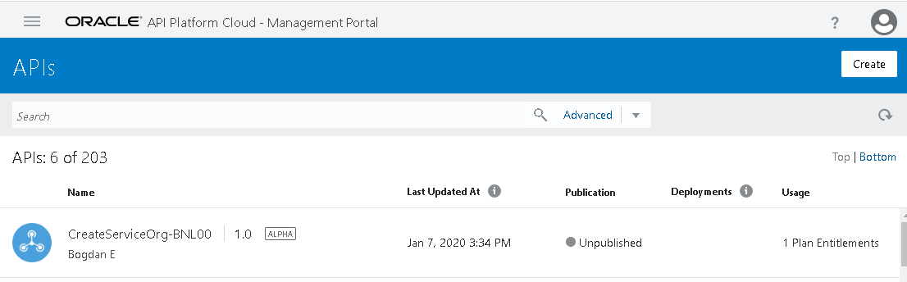
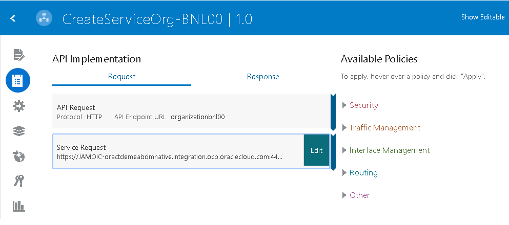
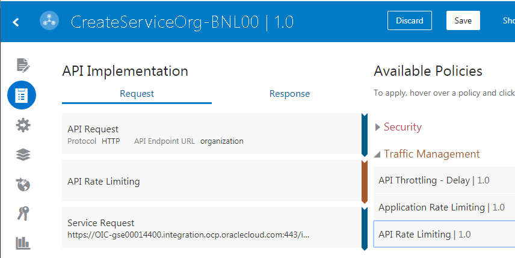
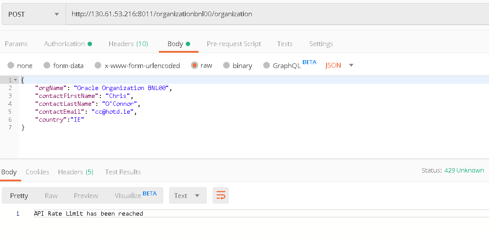
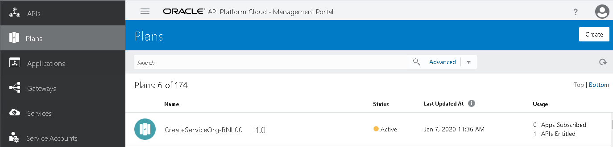
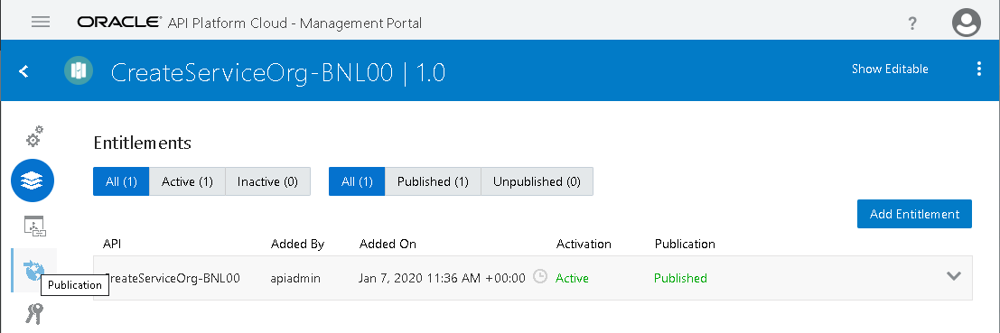
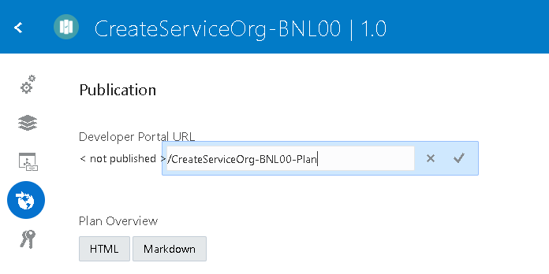
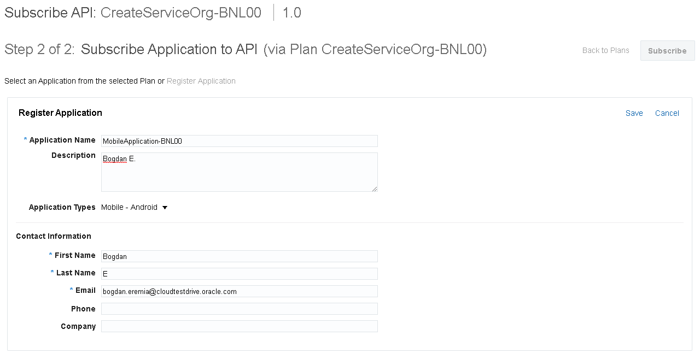
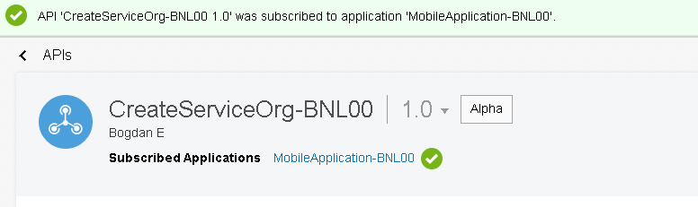

# Layered security, best practices behind firewall, API security

### Login to API Platform

- Now login to API Platform
  - < apip url !!>/apiplatform/apis
  - Please note that the username is different than the one used by OIC (same password)
- Here is my API:

- Note: a Plan has also been created. APIs are made available to developers through
  Plans.

### Change API Request Policy

- Click on **API**, then click on **API Implementation** than on **API Request Policy** and then **Edit**

- Under **API Request URL** enter *OrganizationNN*

### Deploy the API to a Gateway

- Now we will deploy the API to a Gateway
  - These can run anywhere – on-premise, in the Oracle cloud, in any other cloud
- Click on **Settings**

- Click **Deploy API** and click **Deploy**

- Select **Development Gateway**

- The API will get *Active* on **Development Gateway** :

### Activate API Plan

- Click on **Plans**, then click on particular API and then *three dots* on top left corner
  and than **activate**

### Test the API in Postman

- Now let’s test the API – again in Postman - !!!

- How did I know that I had to add the */createOrg* suffix? Let’s look at the API definition:

Our proxy – API Request is /organization

Our backend Service is https://OIC-gse00014400.integration.ocp.oraclecloud.com:443/ic/api/integration/v1/flows/rest/CREATESERVICEORG_01/1.0

Remember the Endpoint for the OIC integration was:

### Add a Policy

- Add the Traffic Policy by selecting *API Rate Limiting* from *Traffic Management* Policies:

- Setup:
  - **API Rate Limit**: *4*
  - **Time Interval**: *Minute*
- Click **Apply**:

- The *API Rate Limiting* should appear in *Request* pipeline:

- Re-deploy to the Gateway
- Test in Postman
  - The 5th request will elicit the following response:

### Publish to the Developer Portal

- Before we publish, let’s look at the Plan:

- The API is listed in the plan, but needs to be published to make it active

- It gets marked as *Published*:

- Now we can publish the plan to the developer portal:

- Choose a plan URL containing the **NN** suffix:

- Once Published, you can unpublish, republish etc.

- Let’s now deploy the API to the Developer Portal

- Choose an API URL containing the NN suffix:

- Click **Publish to Portal**

### Check out the API in the Developer Portal

- !! Login URL is https://aapiad2-gse00014400.apiplatform.ocp.oraclecloud.com/developers
- Here is the API

- Click on it:

- Note the embedded documentation from Apiary.
- Click on **Select Plan**:

Click on **Subscribe**:

APIs are used in the context of an Application, e.g. a mobile app the developer is working on.

- Click Create New Application
  - Enter your app name etc.

- Note the **Application Key** (copy this for later use)
- Click **Subscribe**

- !! XXXX

### Apply a Security Policy

- Back in the API Platform Management Console:

- Select **Key Validation** from **Security Policies** List
- Configure as follows:
  - **Key Delivery Approach**: *Header*
  - **Key Header**: *app-key*
- Click **Apply**:

- Re-deploy the API to the Gateway
- Test in Postman

- Now add the key to the request
- !! XX