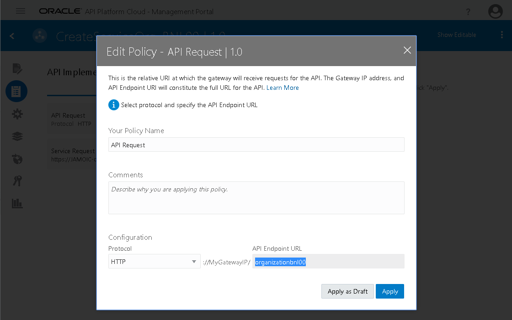
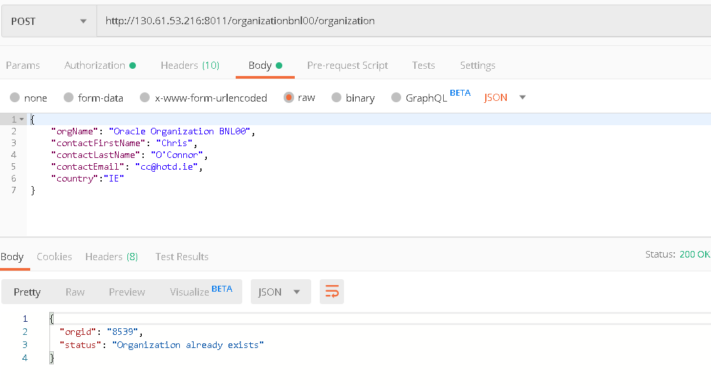
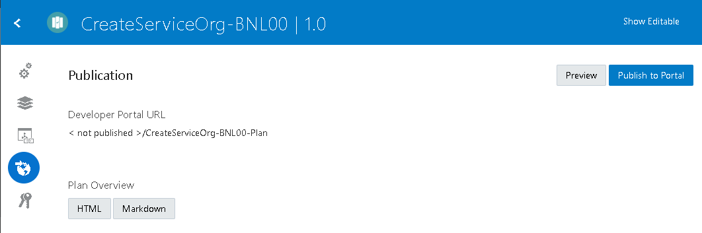
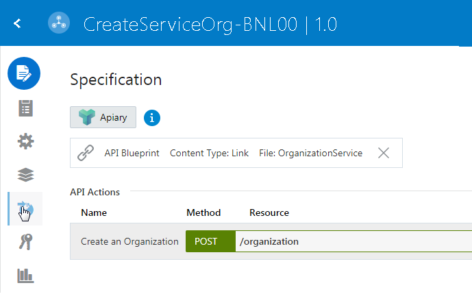

# Layered security, best practices behind firewall, API security

### Login to API Platform

- Now login to API Platform - Management Portal
- Here is my API (look for CreateServiceOrg-*NN* unique API):

- Note: a Plan has also been created. APIs are made available to developers through Plans.

### Change API Request Policy

- Click on **API**, then click on **API Implementation** than on **API Request Policy** and then **Edit**

- Under **API Endpoint URL** enter *organizationNN*; this is the unique suffix that the API will have when deployed to a Gateway

### Deploy the API to a Gateway

- Now we will deploy the API to a Gateway
  - These can run anywhere – on-premise, in the Oracle cloud, in any other cloud
- Click on **Settings**

- Click **Deploy API** and click **Deploy**

- Select **Development Gateway** and **Deploy**

- The API will get *Active* in a while on **Development Gateway** :

- Take note of the *Load Balancer URL* information! It should contain the full URL of the Gateway and the unique suffix (relative path) given to the API:

### Activate API Plan

- Click on **Plans**, then click on particular API and then *three dots* on top left corner and than **Activate**

### Test the API in Postman

- Now let’s test the API – again in Postman

- How did I know that I had to add the */organization* suffix? Let’s look at the API definition:

Our proxy – API Request is /organization**NN**

Our backend Service is https://JAMOIC-oractdemeabdmnative.integration.ocp.oraclecloud.com:443/ic/api/integration/v1/flows/rest/CREATESERVICEORG_**NN**/1.0

Remember the Endpoint for the OIC integration was:

When we configured the REST-Trigger of the *CreateServiceOrg* orchestration, we defined the *Endpoint's relative resource URI* as */organization*

### Add a Policy

- Add the Traffic Policy by selecting *API Rate Limiting* from *Traffic Management* Policies; Click **Apply**

- Setup in second page of configuration:
  - **API Rate Limit**: *4*
  - **Time Interval**: *Minute*
- Click **Apply**:

- The *API Rate Limiting* should appear in *Request* pipeline:

- **Save**
- Re-deploy to the Gateway
- Test in Postman
  - The 5th request will elicit the following response:

### Publish to the Developer Portal

- Before we publish, let’s look at the Plan:

- The API is listed in the plan, but needs to be published to make it active; Click **Publish**

- It gets marked as *Published*:

- Now we can publish the plan to the developer portal; Click *Publication* left menu icon:

- Choose a plan URL containing the **NN** suffix, for example *CreateServiceOrg-NN-Plan*; Click **Save**

- Click **Publish to Portal**:

- Once Published, you can unpublish and then republish etc.

- Let’s now deploy the API to the Developer Portal

- Choose an API URL containing the NN suffix; Click **Save**

- Click **Publish to Portal**

### Check out the API in the Developer Portal

- Login to API Platform - Developer Portal
- Here is the API

- Click on it:

- Note the embedded documentation from Apiary; Click **Subscribe** (upper left corner)
- Click on **Continue** to select default plan:

- Now you should select an application before being able to subscribe:

APIs are used in the context of an Application, e.g. a mobile app the developer is working on.

- Click *Register Application* Link
  - Enter an **Application Name** using *NN* suffix, for example MobileApplication-*NN*
  - Choose an **Application Type**

- Click **Save**
- Your application should get pre-selected;
- Note the *Application Key* (copy this for later use)
- Now you can click **Subscribe**:

- Click **Subscribe**

- Now the Mobile Application is subscribed to the API:

### Apply a Security Policy

- Back in the API Platform Management Console:

- Select **Key Validation** from **Security Policies** List (by clicking **Apply**)
- Configure as follows in the second screen:
  - **Key Delivery Approach**: *Header*
  - **Key Header**: *app-key*
- Click **Apply**:

- Click **Save**
- Re-deploy the API to the Gateway
- Test in Postman

- Now add the key to the request (as *app-key* header) and test again:

- Success!