# Integration of enterprise services and evolution of SOA


### **STEP 1:** Oracle Integration Cloud Overview

-	Login to Oracle Integration Cloud (OIC)

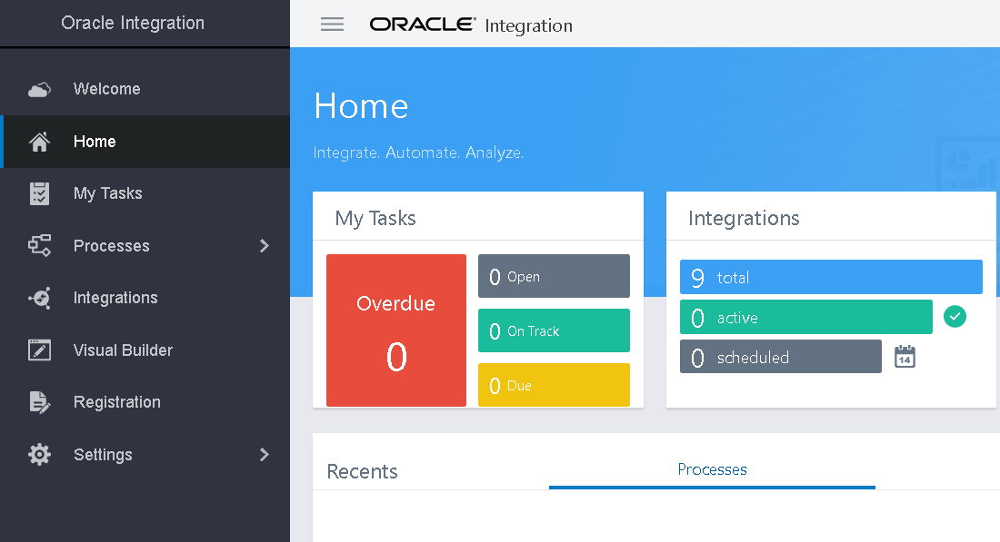

Think of OIC as a toolbox, containing the following –

-	Integrations – to connect applications
-	Processes – to extend applications or create new custom business processes
-	Visual Builder – to create new applications in a low-code environment

-	Click on **Integrations**
    * This brings us into the Integration IDE.

  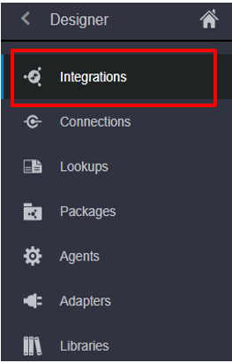

The Integration Designer allows us to do the following –
-	Create Connections to applications
-	Create Integrations, leveraging those Connections
-	Add Lookups to do domain value mapping
    * Eg. the state of California is known as CA in one app, while in the other, it is the full name
-	Package those Integrations into functional units
-	Agents – create connectivity agents for secure communication with on-premise apps
-	Adapters – Connections leverage adapters – see what you get out of the box with OIC.
-	Enhance your integrations with JavaScript libraries


### **STEP 2.1:** Create the Connections - REST

We will create a REST Connection which will trigger our integration, and a Service Cloud connection to communicate with, yo have guessed it, Oracle Service Cloud.

-	Click on **Connections**

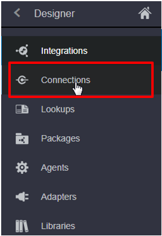

-	Click **Create**

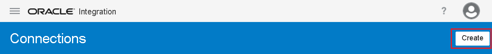

-	Search for the **REST** adapter

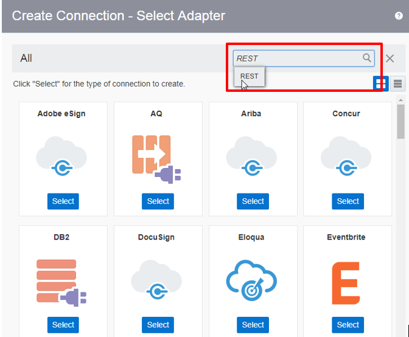

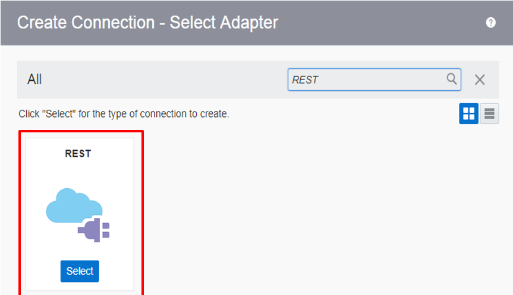

-	Configure as follows
    * **Name**: REST-Trigger-**NN** (Replace **NN** with the number given by your trainers. Do so for all examples in this lab.)
    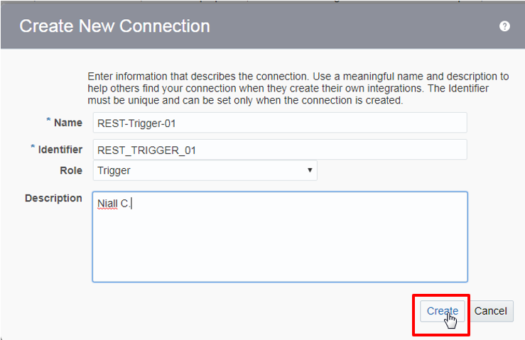

-	Click **Test, Save, Close** , in that order.

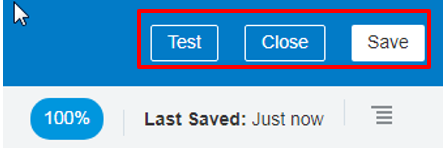

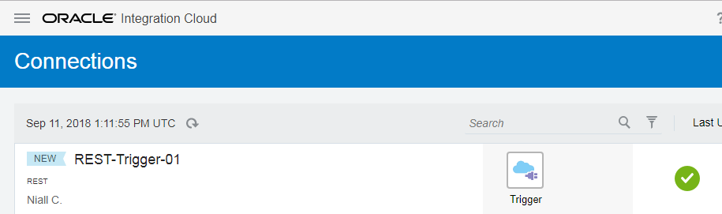


### **STEP 2.2:** Create the Connections - Service Cloud

-	Now **Create** the Service Cloud Connection, you can search to filter away the other adapters.


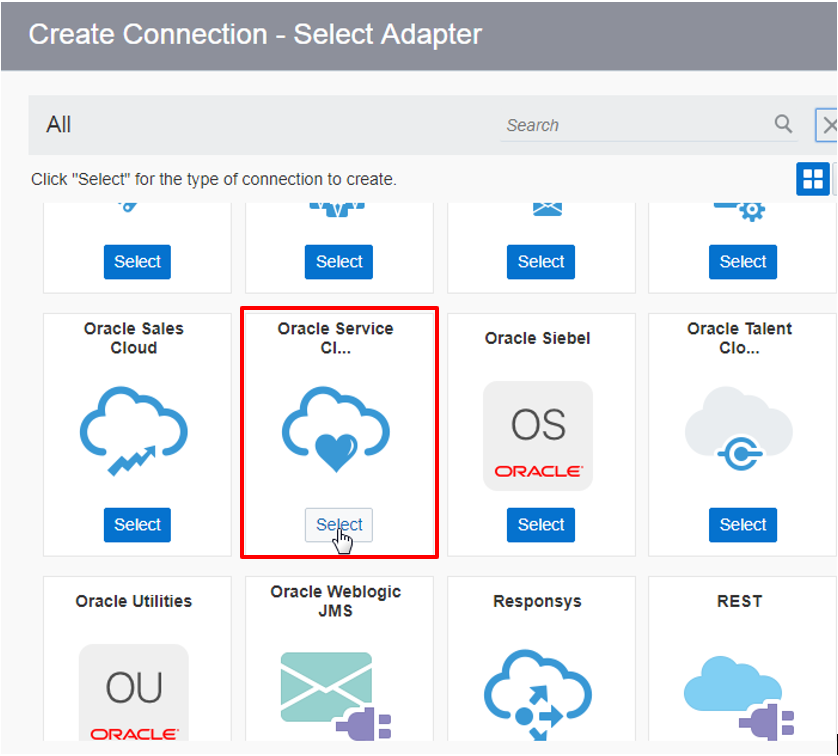

-	**Configure** as follows
    * **Name**: ServiceCloud-**NN**
    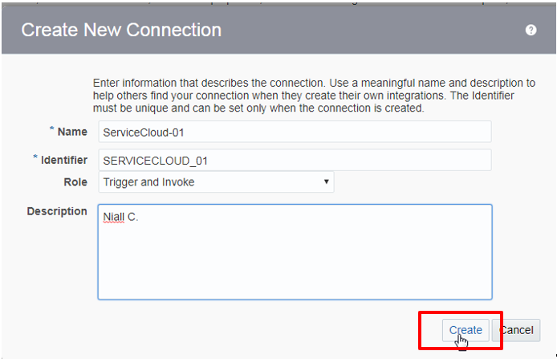

-	**Configure** with the following WSDL URL :
    ```
	https://gsefmwr11.rightnowdemo.com/cgi-bin/integration_test.cfg/services/soap?wsdl
    ```

    * Click **Configure Connectivity**
    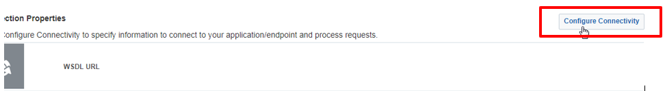

    * Enter the **WSDL URL** and confirm by clicking **OK**
    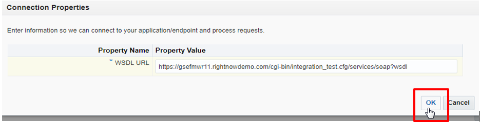

    * Click **Configure Security**
        +	**Username** : Admin2
        +	**Password**: Your trainers will provide this to you
        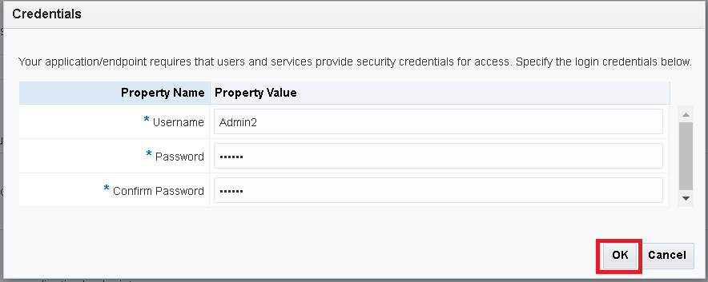

-	Click **Test, Save, Close** , in that order.

You should now be able to see your new connection at the top of the list.

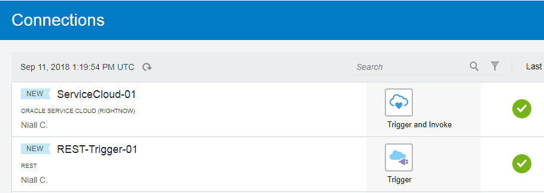


### **STEP 3.1:** Create the Integration - Create App Driven Orchestration

-	Open the main menu and click on **Integrations**

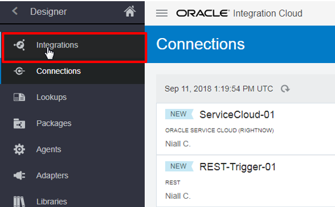

-	Click **Create**

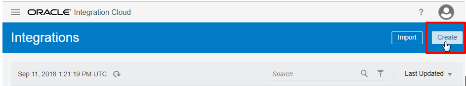

-	Select **App Driven Orchestration**

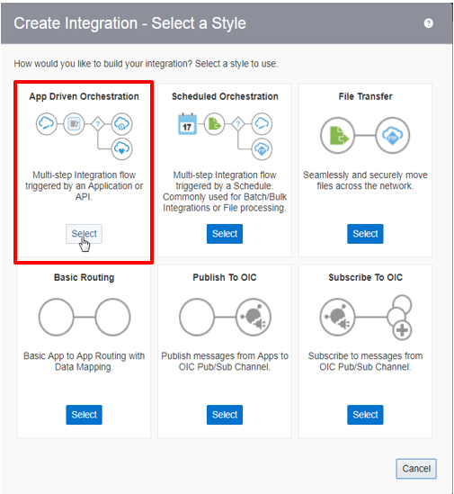

-	**Configure** as follows
    * **Name**: CreateServiceOrg-**NN**
    * **Description**: Your name or initials
    * **Package**: pck-createServiceOrg-**NN**

-	Click **Create**

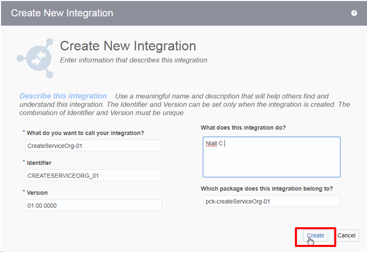


### **STEP 3.2:** Create the Integration - Configure REST Trigger

-	Click on the start node, **search for** and **select your REST Connection**: REST-Trigger-NN

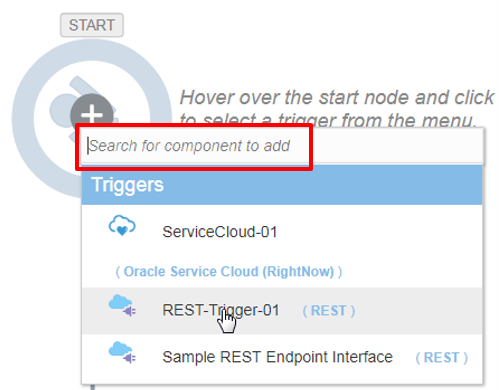

-	**Configure** the REST-Trigger as follows
    * **Name**: *CreateOrgService*
    * **Description**: Your name or initials
    * **Endpoint&#39;s relative resource URI**: /organization
    * **Action** to perform on endpoint: POST
    * Make sure &quot;_Configure a request payload for this endpoint_&quot; and &quot;_Configure this endpoint to receive the response_&quot; are **selected**

-	Click **Next**

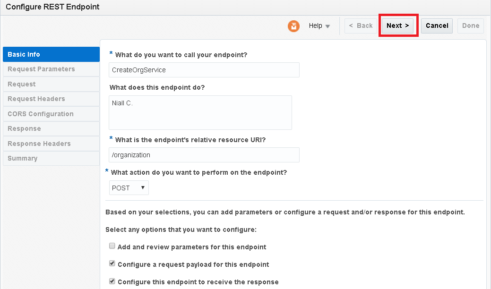

-	The request and response payloads can be taken from our Apiary definition
   
-	In the Request-step:
   
    *	Select **JSON** as payload sample
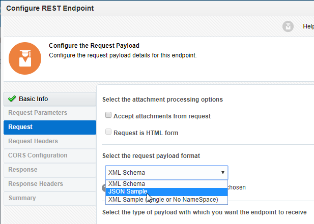
    
    *	Click **&lt;&lt;inline&gt;&gt;**  to enter the example
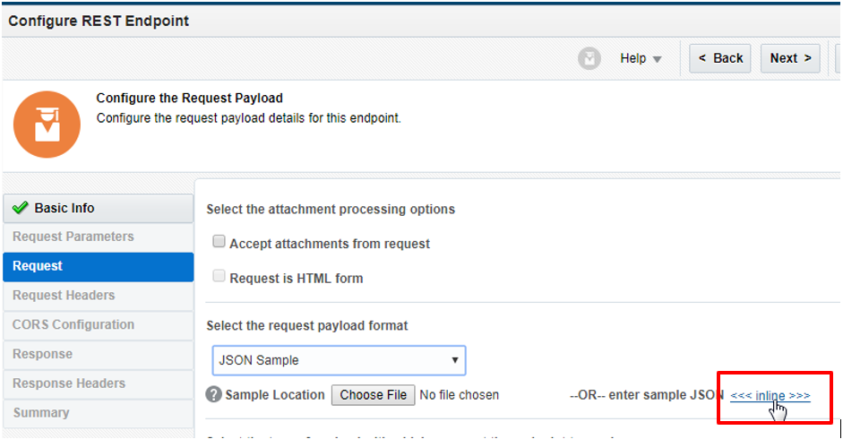
    
    *	Copy the following JSON sample into the editor
	    ```javascript
		{
			"orgName": "Oracle Organization",
			"contactFirstName": "Chris",
			"contactLastName": "OConnnor",
			"contactEmail": "cc@hotd.ie",
			"country": "IE"
    	}
    	```

*	Click **OK**
    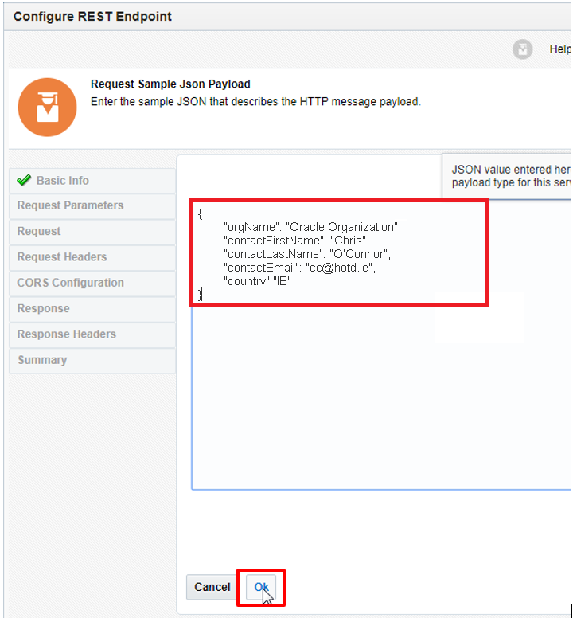
    
*	Click **Next**
    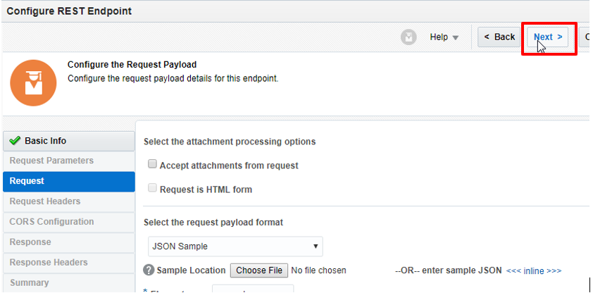


-	In the Response-step:
    *	**Select JSON** as payload sample
    *	**Click** &lt;&lt;inline&gt;&gt; to enter the below example JSON
    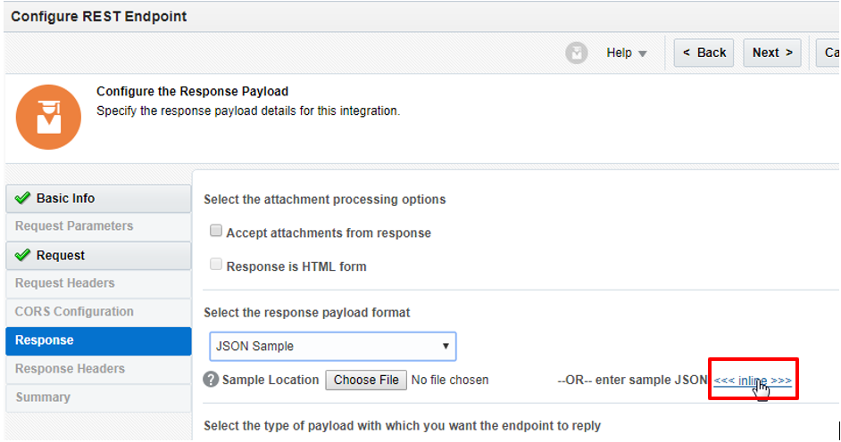

    *	**Copy** the following JSON sample into the editor
        ```javascript
		{
			"orgid": "123",
			"status": "New Org Created"
		}
        ```

    *	Click **OK**
    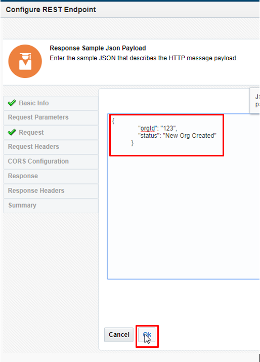

- Click **Next**

- Click **Done**

-	**Save** the Integration

Your Integration should now look something like this:

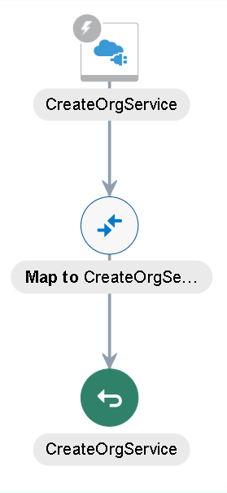


### **STEP 3.3:** Create the Integration - Check if Organization exists

Before creating a new organization, the first thing we will do is to check whether the organization already exists.
For this we will use the Service Cloud Connection.

-	**Drag and Drop** _your_ Service Cloud Connection (ServiceCloud-NN) after the Trigger *CreateOrgService*. Once you start to move the connector onto the canvas, you will see a plus-sign (+) just under the *CreateOrgService*. Drop the connector on this sign.

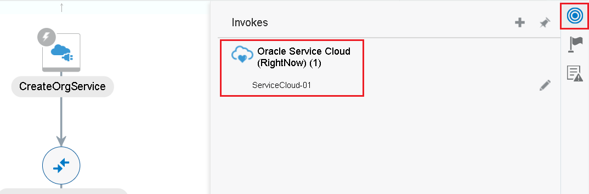

-	**Configure** as follows
    * Name of endpoint: CheckIfOrgExists

-	Click **Next**

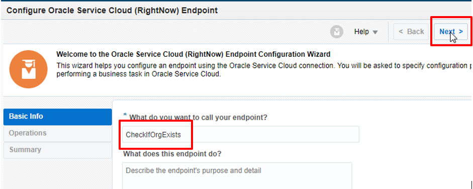

-	**Configure** as follows
    * Select Operation mode: **Single** operation
    * Operation type: **ROQL** (ROQL is an SQL like query language for Service Cloud)
    
        + Select **Query objects** as Cloud Operation
	*	Enter the following query
        ```
		SELECT organization from organization where organization.name = '&orgName'
        ```

    * Click on **Parameter Bindings**
    * Enter **orgName**: HOTD
	* Click _Test My Query_
    
    
  
  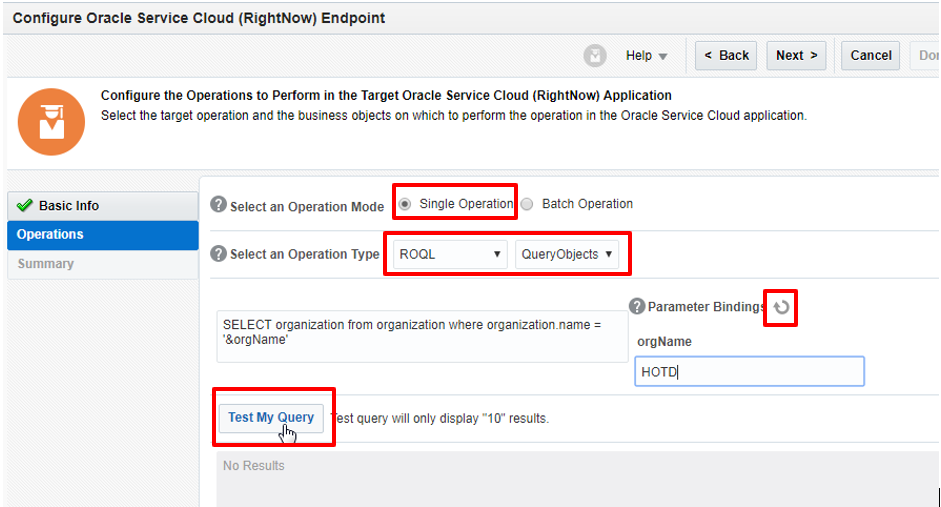

You should have 10 results found, with a response that looks like this:

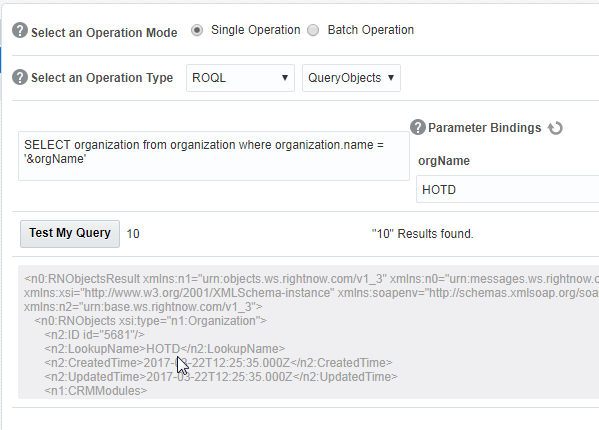

-	Click **Next** and **Done** to close the Service Cloud connector
-	**Save** the Integration

Your integration now looks like this:

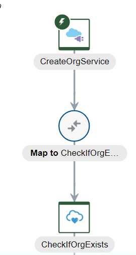

Now we need to map the incoming *orgName* to the *CheckIfOrgExists* parameter.

-	**Hover** over, or click on the &quot;*Map to CheckIfOrgExists*&quot;, and **click** on the little pencil-icon to edit

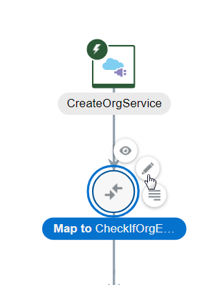

-	**Map** as follows
    * Mark *orgName* in the left column by clicking on it
    * Mark *orgName* in the right column by clicking on it
    * Click on &quot;Map&quot; to create the mapping
    * **OR** drag &amp; drop the source to target

  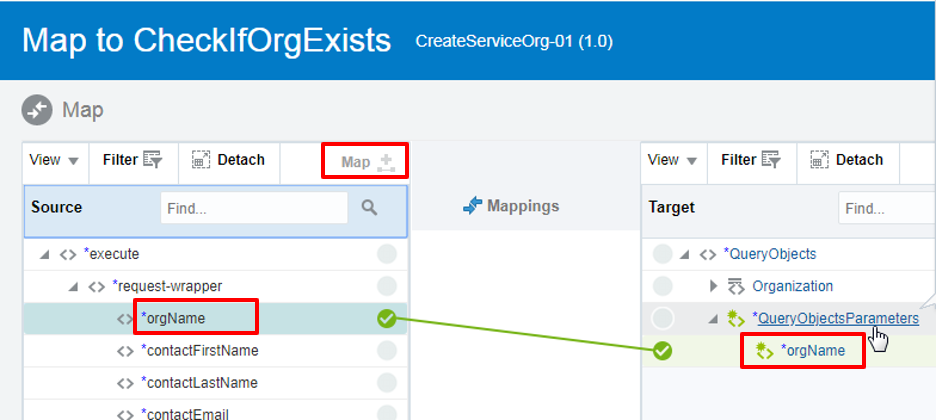

-	Click **Validate** and **Close**
-	**Save** the Integration

Your integration now looks like this:

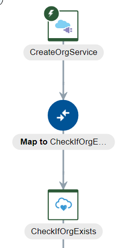

Now we will add a *Switch* action, which is essentially an if/else check.

If the Organization already exists, then we will return the *orgId* and a message – _&quot;Organization already exists&quot;._

If the Organization does not already exist, then we will create it and return the *orgId* and a message – _&quot;Organization created&quot;._

-	**Drag &amp; Drop** the **Switch** from the Actions Tab on the right and drop it right after *CheckIfOrgExists*

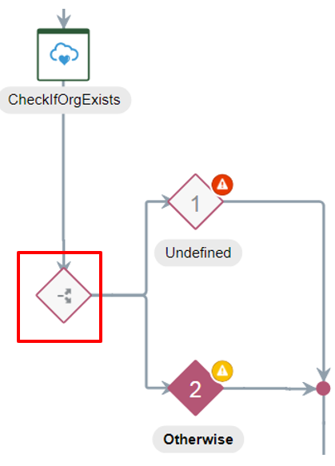

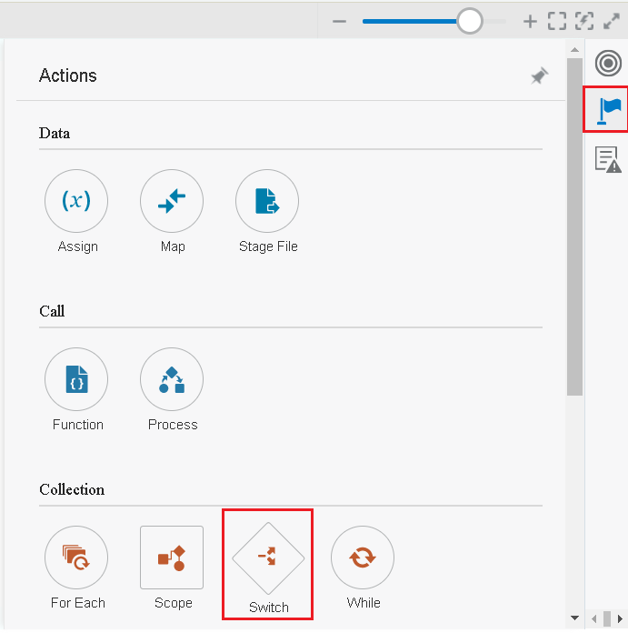


### **STEP 3.4:** Create the Integration - Case Organization exists

-	**Edit** path 1 by clicking on the pencil-icon:

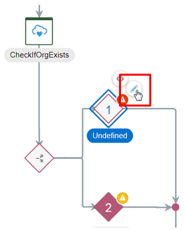

-	**Configure** as follows
    * **Expression name**: Org Already Exists
    * In the Expression-editor, **enter** : count()
    * Verify the condition is set to &quot;&gt;&quot;  and  &quot;0&quot; – greater than zero

  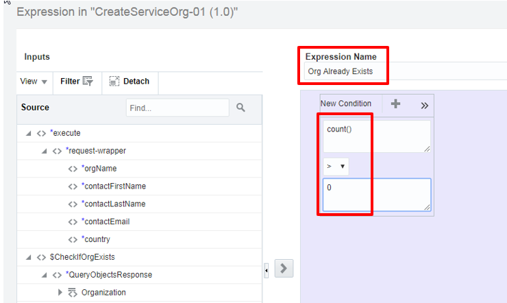

The Expression is now &quot;count() &gt; 0&quot;; but the count of what? Naturally, the count of the objects returned by *CheckIfOrgExists*. So we need to add this variable to the count().

-	**Drag &amp; Drop** Organization into the count()-expression ( **OR** mark and click  on the&quot;&gt;&quot;-icon)

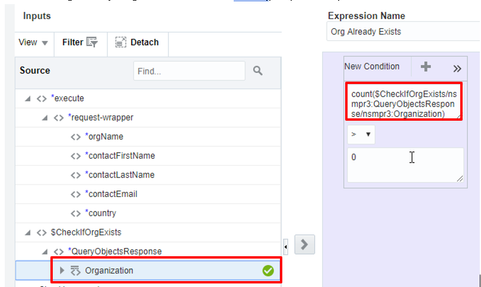

-	Click **Validate** and then **Close**
-	**Save** the Integration

If you hover over Route 1, you should see something like this:

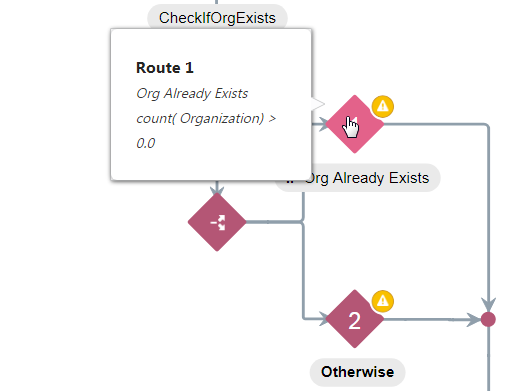

Now, in Path 1, we simply add a *Map* to assign the return variable.

-	From the Actions-tab, **Drag &amp; Drop** a **Map** on the path just after &quot;Org Already Exists&quot;
-	**Map** as follows
    * id to orgId

  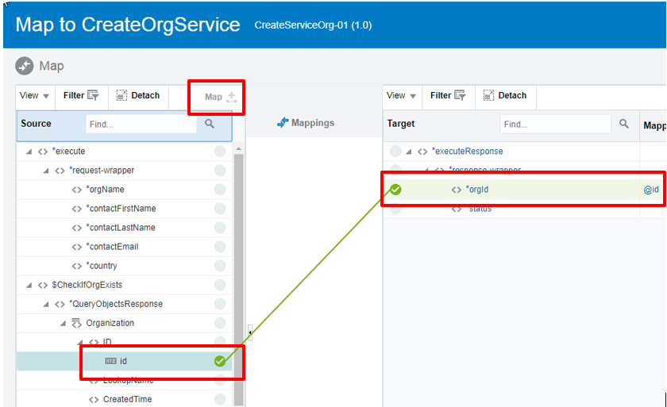

To manually set the status to a text – do as follows

-	Click on the *status* link

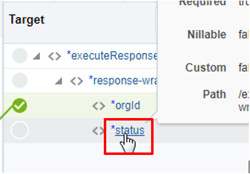

-	Enter statement: *Organization already exists*
-	Click **Save**

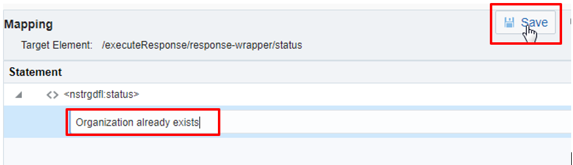

-	Click **Close**
-	**Verify** the mapping

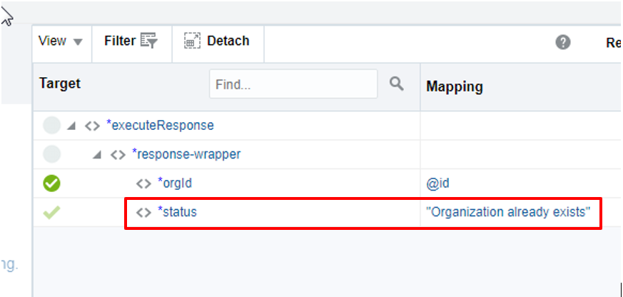

-	Click **Validate** and then **Close**
-	**Save** the Integration

Your integration should now look like this:

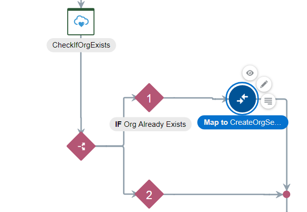


### **STEP 3.5:** Create the Integration - Case New Organization

Now to configure Path 2 – Otherwise

Here we will leverage the Service Cloud Connection to create an Organization in Service Cloud.

-	**Drag &amp; Drop** _your_ Service Cloud Connection (ServiceCloud-NN) onto Path 2.
-	Call the endpoint: CreateOrg; Click **Next**
-	**Configure** as follows
    * **Operation type**: CRUD &amp; Create
    * Search for Org, and **select** Business Object Organization by marking it and clicking on the &quot;&gt;&quot;-icon
    * Click **Next**
    * Click **Done**
-	**Save** the Integration

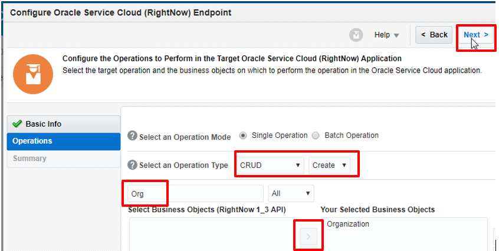

Your integration should now look like this:

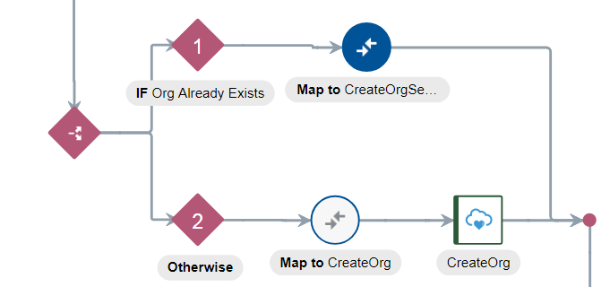

-	Do the **Mapping** between *Otherwise* and *CreateOrg*

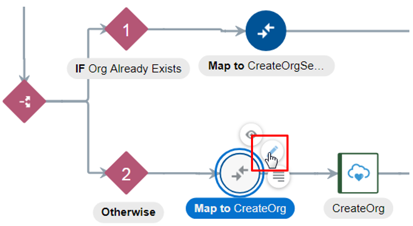

-	**Configure** as follows
    * orgName to Name
-	Click **Validate** and **Close**
-	**Save** the Integration

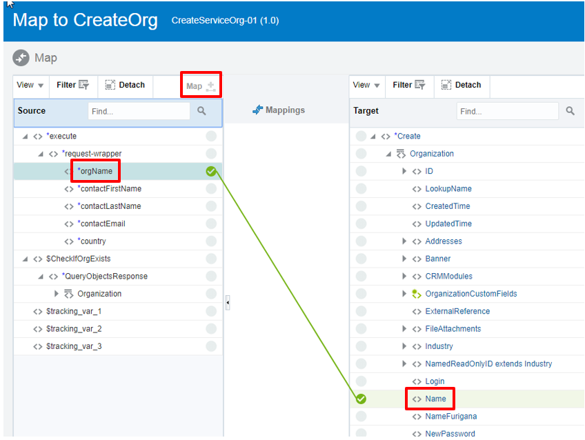

Your integration is almost done! Now, in Path 2, we just need to add a final MAP to assign the return variable.

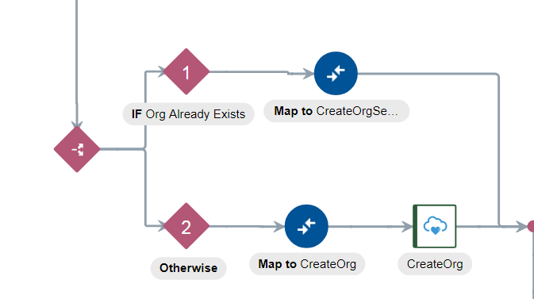

-	**Drag &amp; Drop** a **Map** Action into Path 2 after CreateOrg
-	**Configure** as follows
    * id to orgid

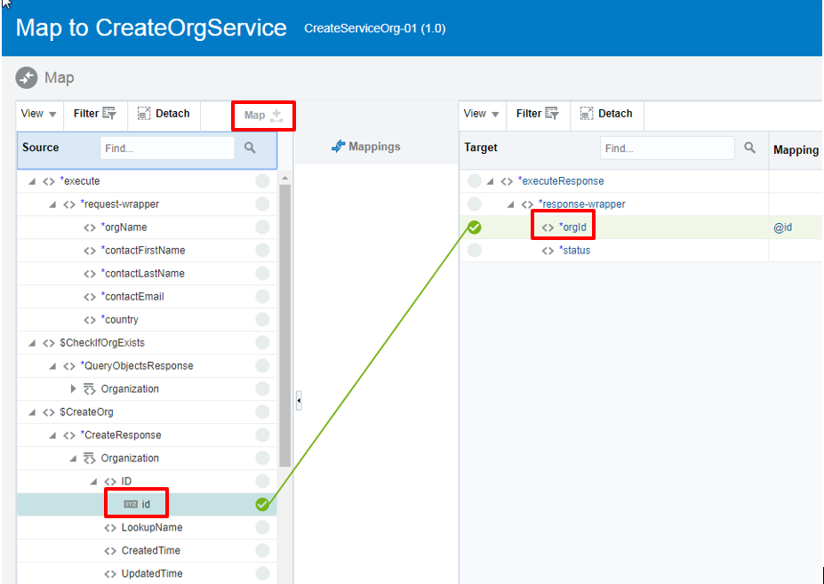

To manually set the status to a text – do as follows

-	**Click** on the status link

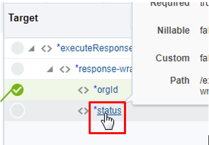

-	Enter statement: *Organization Created*
-	Click **Save**
-	Click **Close**

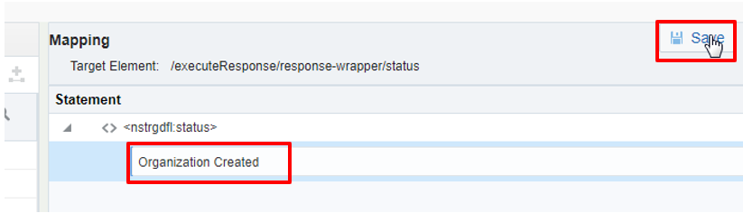

-	**Verify** the mapping

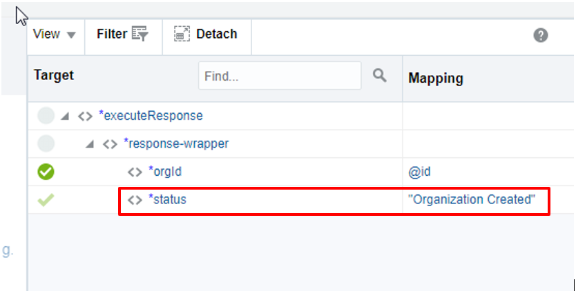

-	Click **Validate** and then **Close**
-	**Save** the Integration

Your integration should now look something like this:

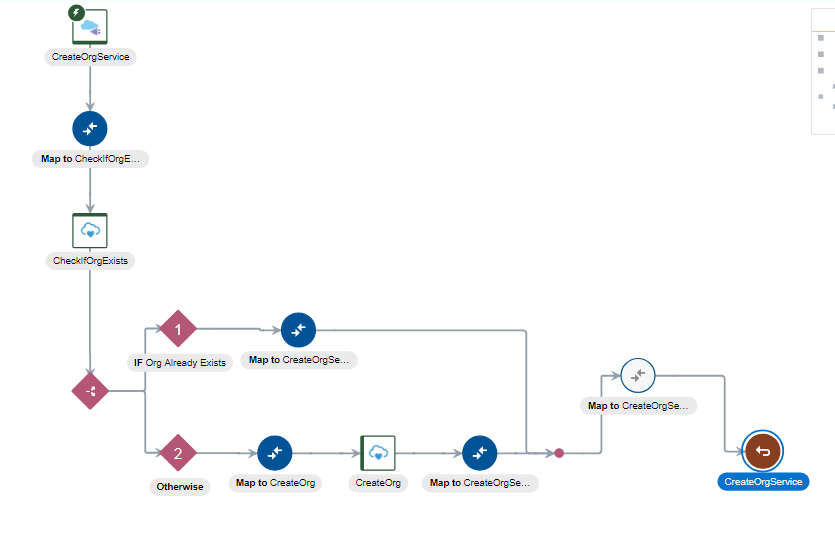

All we need to do is delete the empty Map, just before the return

-	Click on the &quot;more&quot;-icon on the Map-action
-	Click **Delete**
-	**Save** the Integration

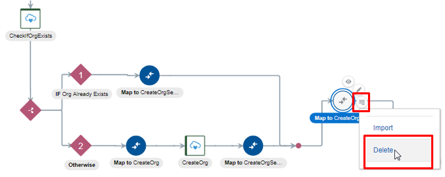

The completed integration!

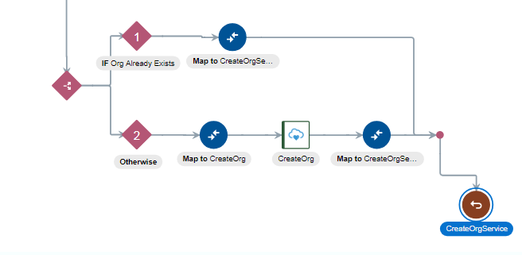


### **STEP 3.6:** Create the Integration - Setup tracking

Before we activate and publish, we still need to set a tracking field, for auditing/monitoring purposes

-	From the &quot;more&quot;-menu in the upper-right corner, **click** Tracking

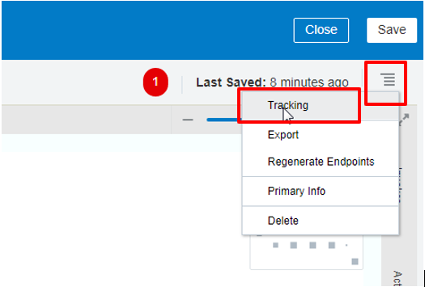

-	**Configure** as follows
    * **Drag &amp; Drop** the orgName onto the Tracking Field

  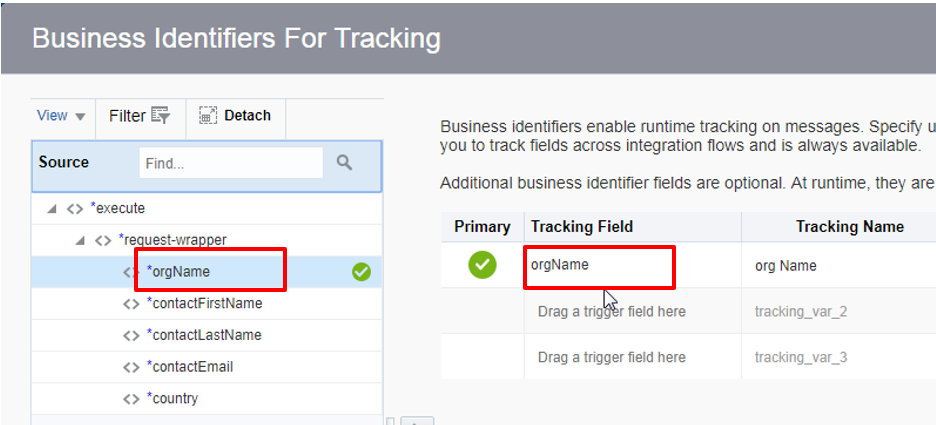

-	**Save** and **Close** the Integration


### **STEP 4:** Activate the Integration

It&#39;s finally time to activate and publish your integration!

From the Integrations-list

-	Identify _your_ Integration – CreateServiceOrg-NN (you can search to filter the results)
-	Activate the Integration – **Activate** - by clicking on the switch

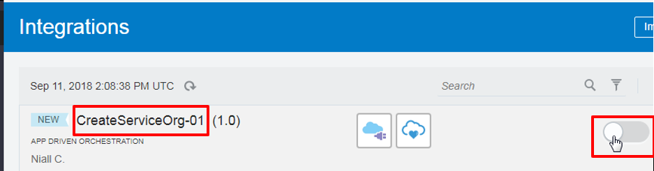

-	Click **Activate and Publish**

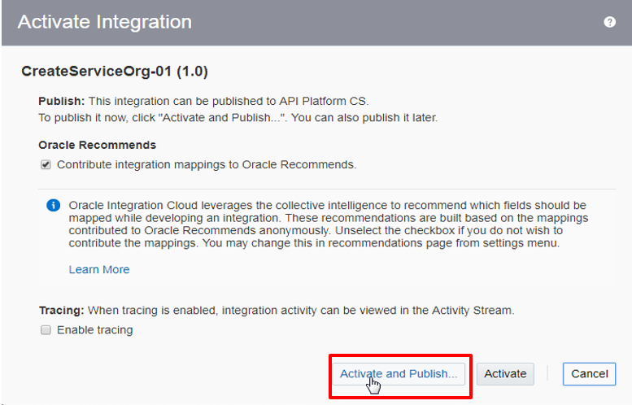

-	Note: we are only creating the API definition in APIP Platform. We will deploy it to an API Gateway later. Finally, we will then also publish it to the API Developers Portal.

-	Configure
    * **API Name**: CreateServiceOrg-**NN** 
	* **Version**: 1.0
	* **API Endpoint URL**: /organization

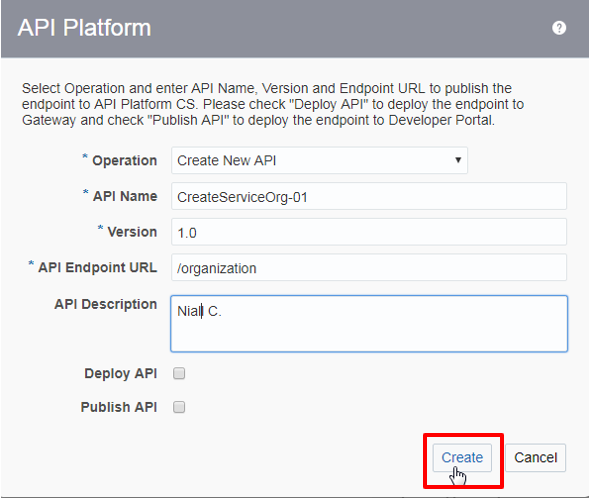

-	Click **Create** 


### **STEP 5:** Test using Postman

You will need to have Postman (or a similar program) installed for this step

-	Click on the **URL** to get the _REST Endpoint_

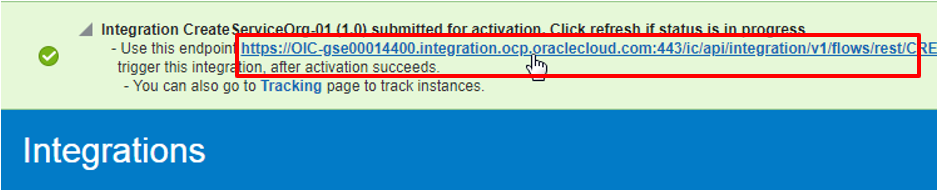

You can also find that link here

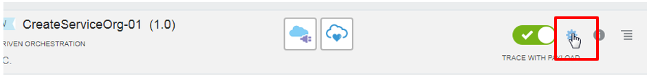

This directs to a very handy page, the Endpoint Description.
-	Copy the **Endpoint URL**
-	Copy the **Request sample**

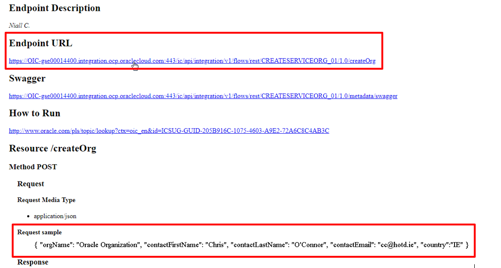

-	In Postman, open a **New Request**-tab
    * Enter the **Endpoint URL** you copied
    * Make sure you are using a **POST** -call
    * Under the tab **Authorization**
        + **Type**: Basic Auth
        + Enter your **OIC credentials**

  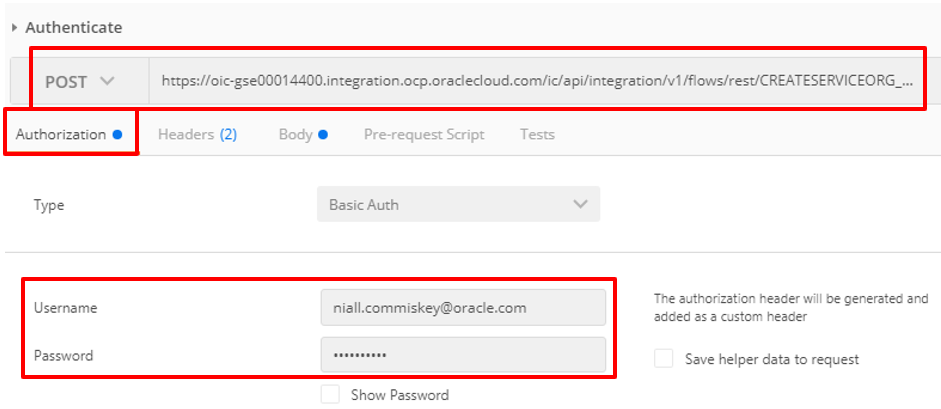

-	Click on the **Body** -tab
    * Choose **&quot;raw&quot;s**
    * Select **&quot;JSON(application/json)&quot;**
  
-	Enter the **request payload** you copied from the **Request sample** (similar to this)
    ```javascript
	{
		"orgName": "Oracle Organization", 
		"contactFirstName": "Chris",
		"contactLastName": "O'Connor",
		"contactEmail": "cc@hotd.ie",
		"country":"IE"
	}
    ```

    * **Modify** the orgName to: Oracle Organization **NN** where **NN** represents the unique number given by your trainers

-	Click **Send**
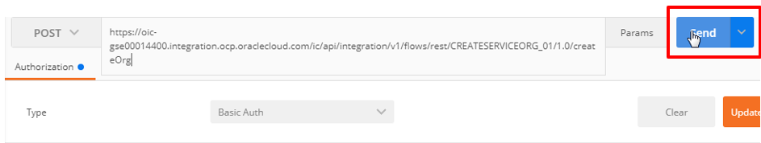

-	You should have a Request-Response which looks like this:
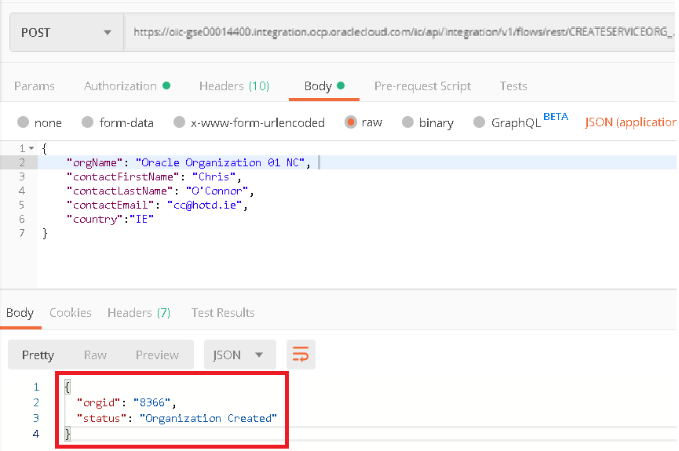

-	You can compare the Response to the example-Response from the Endpoint Description page.

-	Verify &quot;Organization Created&quot;

-	Click **Send** again
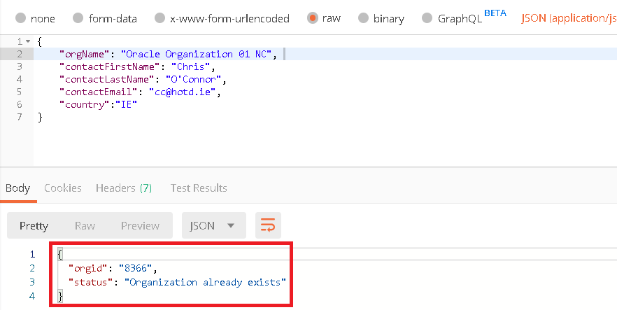

-	Note the different Response
